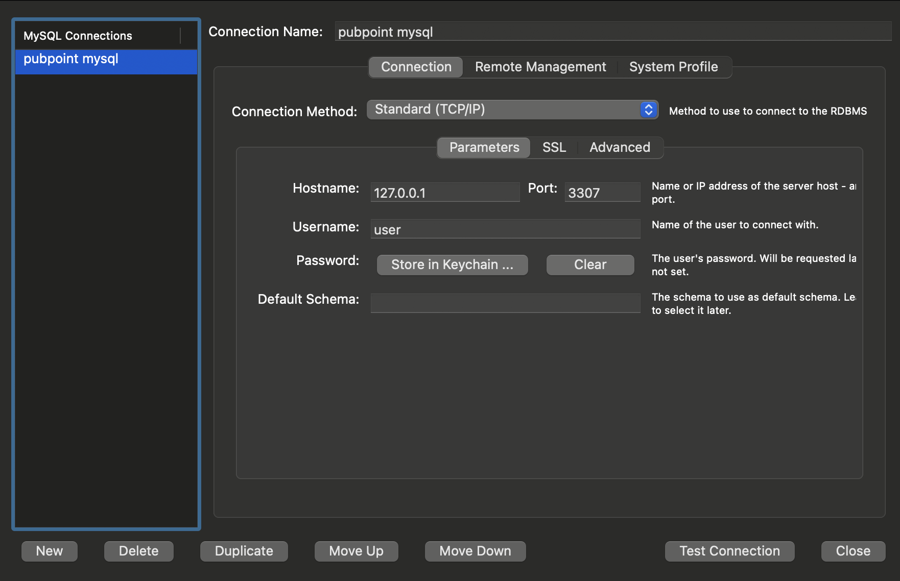

# pubPoint

*Add problem + solution explanation when app is in production.*

## Running project
App has been broken into 3 different docker images (frontend, backend and mysql db). Docker-compose has been set-up to allow the quick spin up and spin down of containers.

## Prerequisites
Make sure you have the following installed:

- **Python**: `>= 3.12`  
  - Check with: `python --version`
  - Install from: [python.org](https://www.python.org/downloads/)

- **Docker**: `>= 27.3`
  - Check with: `docker --version`
  - Install from: [docker.com](https://www.docker.com/get-started)

### Setup Python Environment
Create environment:
`cp .env.template .env`
`cd app/backend`
`python -m venv venv`

Then load the environment in your IDE.

Install dependencies:
`pip install -r requirements.txt`

### To build containers
`docker-compose up --build`

### To spin up
`docker-compose up`

### To spin down
`docker-compose down`

### To delete mysql data
`docker-compose down —-volumes`

### Investigating and running code inside a docker container

Running bash inside a container:

`docker exec -it <mycontainer> sh`

eg.

`docker exec -it pubpoint-backend-1 sh`

I have made various bash scripts which give other ways of running code inside a docker container (see `populate_pubs.sh` as an example).

### Sharing the Database

For initial development, I (TS) have been storing the database as a local persistent volume. I can share this as a one time mysql dump file to allow you to start developing. Ultimately, this will be hosted but is a sensible method of sharing for initial development.

Instructions on this are below:

`ADD INSTRUCTIONS!!!!!!`

###

## Commonly Encountered Issues

### Populate as issues are found

## Contributing
Hot reload has been enabled on both front and backend.

Docker desktop must be opened before running `docker-compose up`.

Recommend forking the project for initial experimentation. When ready to contribute, write access to the main repo can be set-up.

### Mock Mode

When wanting to use local dev mysql database edit .env to have MOCK_MODE=true (capitalisation is not important).

This is persistent between container spin up and spin down due to image volume storage. This can be cleared using the above given command `docker-compose down —-volumes`.

### Template .env

Template .env file provided called ".env.template". Placeholder values have been added for the variables and these should be updated.

To update:

1. `cp .env.template  .env`

1. Update values. Mock database set-up as desired (recommend to leave as placeholder valies). API KEY look at below instructions for google developer api set-up. 

### To populate local mysql storage

I have set-up various utils endpoints to populate the dev local mysql tables for the persistent container volume storage.

To populate pubs: postman has populate pubs endpoint set-up. Will load in London pubs. Endpoint is http://localhost:5001/utils/populate-pubs with a PUT request.

### Contributing check-list

* Google developer account with activated api key added to .env.

* Set up ".env".

* Docker Desktop installed.

* Postman (ask TS to be added to repo for existing endpoints).

* Access to notion (ask to be added, contains planning info).

* Access to github (obviously). When ready to contribute, write access to the main repo can be set-up.

* Docker-compose file shows the host ports for accessing containers.

* MySql workbench for viewing database.

### Google developer API set-up
1. Head to "https://console.cloud.google.com/welcome".

1. APIs and services.

1. Create Project, name it e.g. pubPoint.

1. Enabled APIs and services

1. Enable “Routes API” and “Places API (New)”

1. Credentials.

1. CREATE CREDENTIALS (towards top), Api Key.

1. Recommended, set up restrictions → click 3 dots, go to edit, restrict key to selected api, needed ones are “Routes API” and “Places API (New)”. 

1. Add this to .env, I have provided template .env for this, DO NOT HARD CODE INTO CHECKED IN FILES.

### MySQL workbench set-up

### Contributing Software Process

Add an `epic/your-feature` branch. Merge into `main` using a PR. Commits should be atomic. Tag commits in `main` with version for release.

